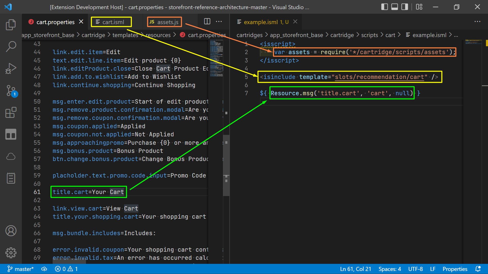
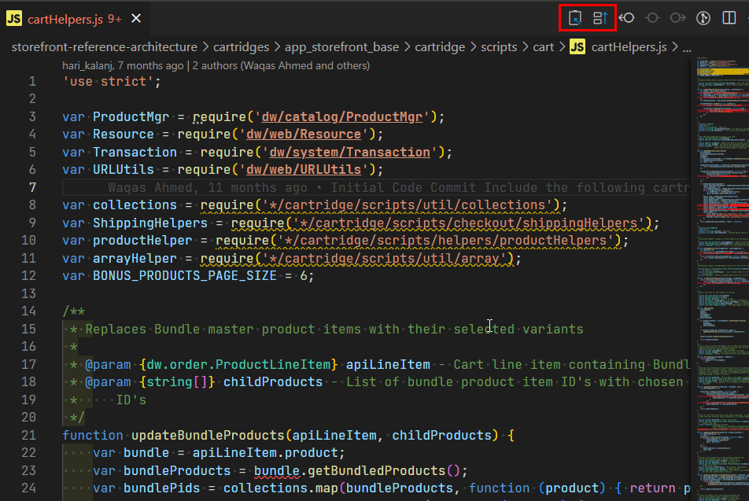
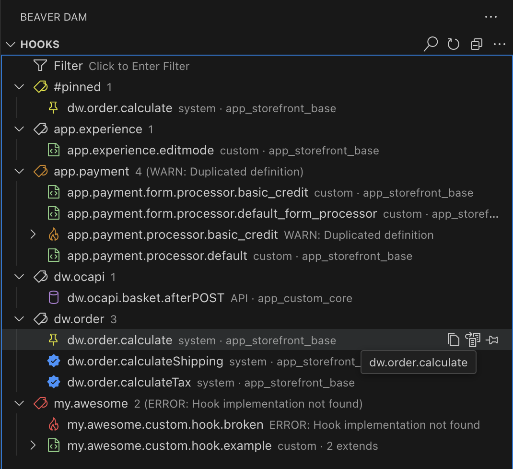
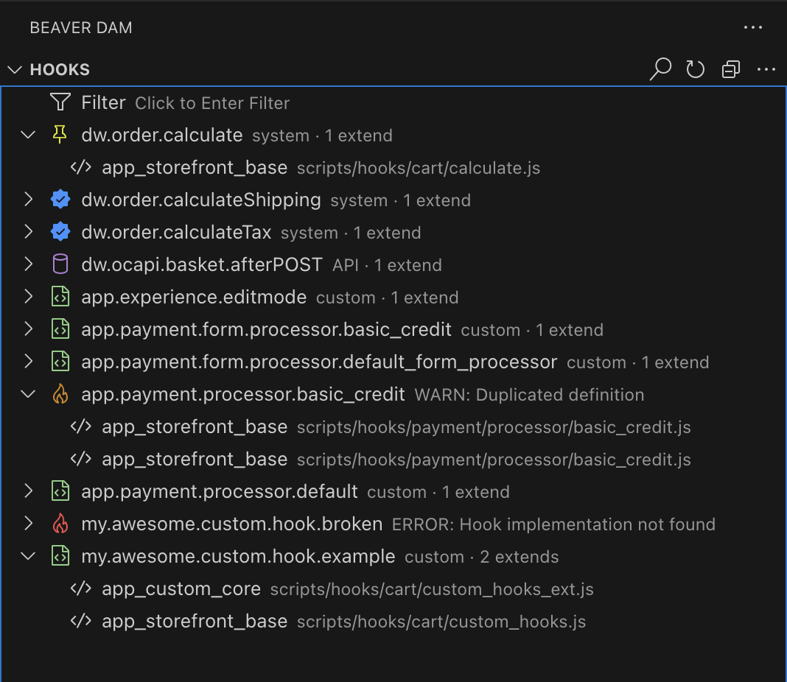
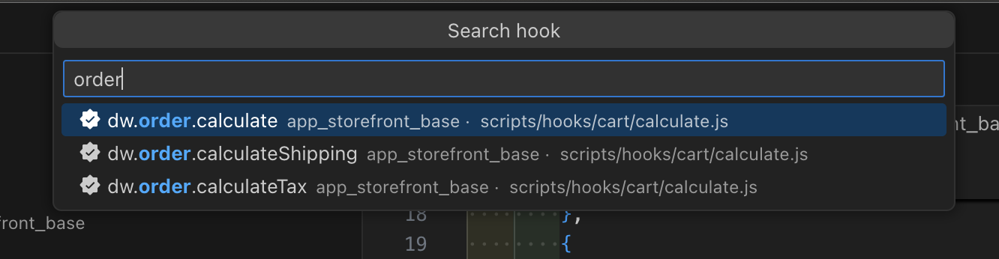
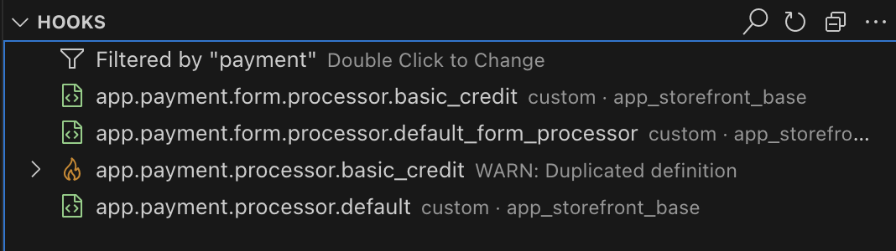

# 🦫 SFCC Beaver

_Extension for Salesforce Commerce Cloud (SFCC) Developers_

## #StandWithUkraine 🇺🇦

Russia invaded Ukraine, killing tens of thousands of civilians and displacing millions more.
It's a genocide. Please help us defend freedom, democracy and Ukraine's right to exist.

Visit https://stand-with-ukraine.pp.ua to see more details.

Thanks ✊

## Features

- Quick File **Override**
  - Easily override files from one cartridge to another.
- File Require **Extract**
  - A reliable alternative to path auto-completion for `.js`, `.isml`, `.properties`
- **Hooks** Support
  - Provides overview, search, filter, and validation for SFCC hooks.
- **Documentation** Support
  - 🤒 Documentation Search temporary is not working due to documentation portal changes.

## Compatibility

> Extension fully supports only SFRA projects. However, some of the features are compatible with SiteGen as well. Both Windows and Mac are supported.

## Usage

### Extract/Override

Use top VS Code panel to easily create a copy of an active file in another cartridge 

or copy current file path into clipboard 

> 💡 You can use Command Pallette to do it even quicker. See below.

### Commands

Beaver adds several new commands that you can run manually.

To run a command you need to open the command pallette (press `F1` or `Ctrl + Shift + P`) and enter the command name.

- **▰ Extract** A swiss-knife command that copies to clipboard a require of the file depends on type:
  - for scripts file copy require: `var fileName = require('*/filePath')`
  - for templates file copy isinclude: `<isinclude template='templatePath' />`
  - for resource properties file copy active line as `Resource.msg('{activeLinePropName}', '{fileName}', null)`
- **▰ Copy unix path** command copies file path relatively to the project root folder.
- **▰ Override** command overrides current file to another cartridge

### Beaver Dam

Beaver introduces a new side section called Beaver Dam. There are two items currently:

#### **# Cartridges**

is a active cartridge list where you can pin/unpin cartridge for overriding.

#### **# Documentation**

Search in docs without leaving VS Code. Currently not working.

#### **# Hooks**

_Tag Compact View:_

_List Full View:_

- Provides an overview of all hooks defined and used in the project
- Hooks can be pinned for quick access
- Two view mode:
  - List Mode. Best for small collections of hooks
  - Tag Mode. Best for big collections
  - You can change modes in Settings or by clicking on tree dots on Hooks panel.
- **Search**. Click Search icon or use shortcut `Ctrl + Shift + H`/
  `Command + Shift + H`\* to open search panel

  - \* it overrides the system `Find and Replace` command. Should you use this command often please reassign it.

  

- **Filter**. Click filter on hook panel to apply a filter by name to the list of hooks.

  

- Quick navigation to hooks implementation/definition.
- Hooks configuration validation.

### Hovers

If you hover over the API class such as `require('dw/web/URLUtils')` you see a tip with `▰ Open docs` suggestion. Clicking it will open corresponding documentation topic.

### JSON Schemas

Schemas provide autocompletion and validation for JSON. Currently supported:

- Hooks → `hooks.json`
- Job Steps → `steptypes.json`

## 👍 Recommendations

Install the icons extension **[🦫 SFCC Beaver - Icons](https://marketplace.visualstudio.com/items?itemName=SerhiiHlavatskyi.sfcc-beaver-icons 'Open marketplace')** to have SFCC-specific icons.

## 📨 Feedback

Found a 🪲bug or want to improve something? Feel free to open an issue on GitHub: <https://github.com/foegit/sfcc-beaver/issues>

## Credits

- Badge Service: https://shields.io/
