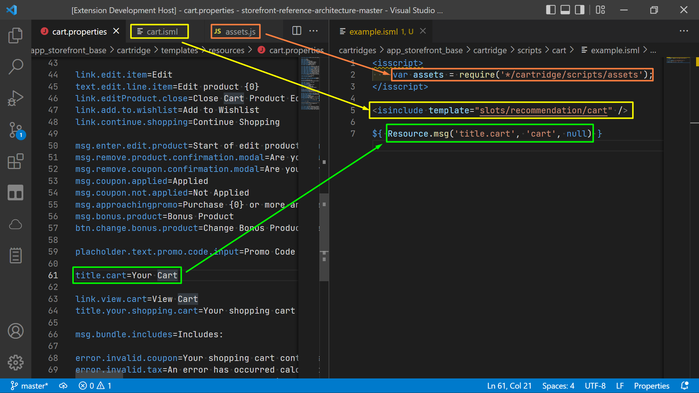
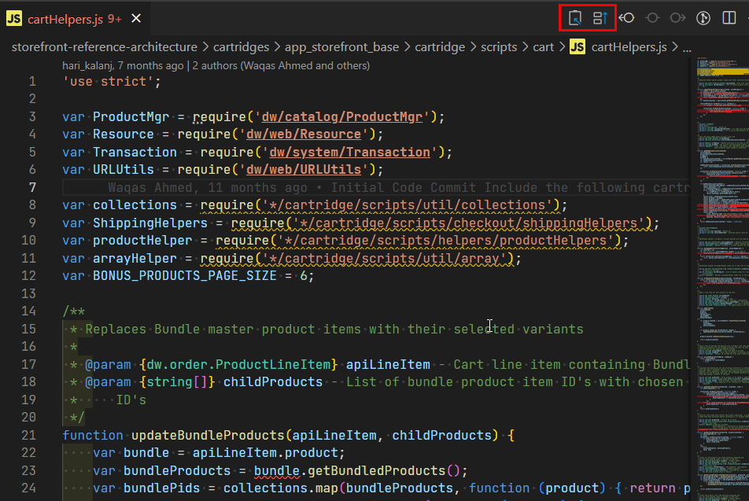
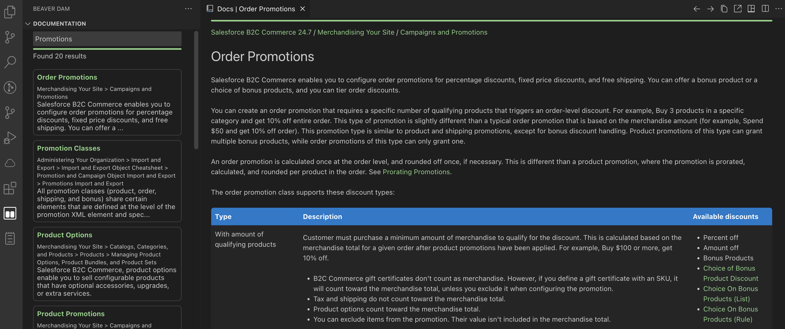
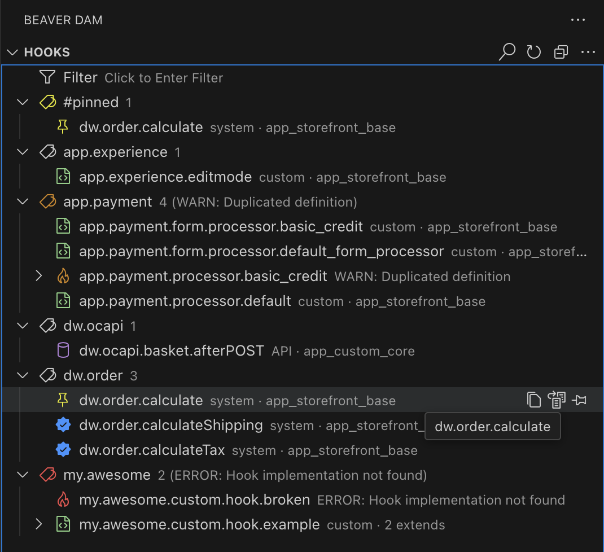
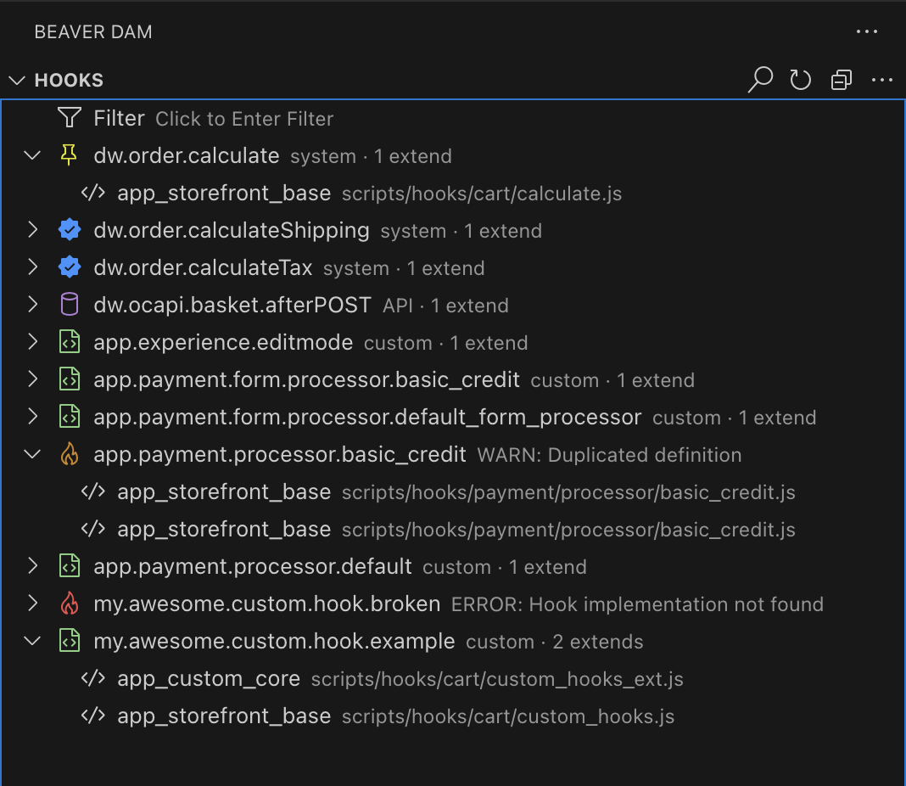
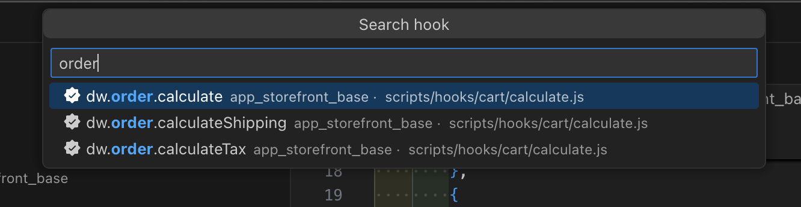
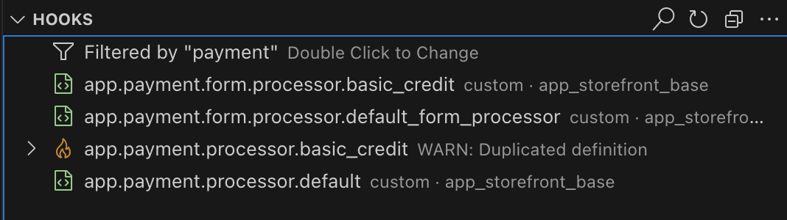

# SFCC Beaver

_A VS Code extension for Salesforce Commerce Cloud developers_

_Override files, explore hooks, and search docs — without leaving your editor_

## Features

- Quick File **Override** — override files from one cartridge to another
- File Require **Extract** — reliable alternative to path auto-completion for `.js`, `.isml`, `.properties`
- **Hooks** Support — overview, search, filter, and validation for SFCC hooks
- **Documentation** Support — built-in documentation search with improved UI

## Compatibility

Designed and tested for **SFRA** projects.

 

## Usage

### Extract / Override

Use the top VS Code panel to create a copy of the active file in another cartridge: 

Or copy the current file path to the clipboard:
 

> 💡 You can also use the Command Palette for quicker access. See below.

### Commands

Open the Command Palette (`F1` or `Ctrl + Shift + P`) and enter a command name:

- **▰ Extract** — copies a require/include/resource reference to the clipboard depending on file type:
  - Script: `var fileName = require('*/filePath')`
  - Template: `<isinclude template='templatePath' />`
  - Properties: `Resource.msg('{activeLinePropName}', '{fileName}', null)`
- **▰ Copy Unix Path** — copies the file path relative to the project root
- **▰ Override** — overrides the current file to another cartridge

### Beaver Dam

Beaver adds a sidebar panel called **Beaver Dam** with three sections:

#### Cartridges

Active cartridge list. Pin or unpin cartridges for overriding, and exclude them from VS Code global search.

#### Documentation

Search SFCC docs without leaving VS Code.

- Search and view documentation inside VS Code
- Back/forward navigation
- Quick link copy
- Open in browser
- Split/combine with the active editor group
- Improved tables and code block rendering

#### Hooks

_Tag Compact View:_

_List Full View:_

- Overview of all hooks defined and used in the project
- Pin hooks for quick access
- Two view modes:
  - **List** — best for small collections
  - **Tag** — best for large collections
- **Search** — click the search icon or press `Ctrl + Shift + H` / `Command + Shift + H`

  > ⚠️ The Mac shortcut overrides the system Hide Window command. If you use that often, reassign it.

  

- **Filter** — filter hooks by name

  

- Quick navigation to hook implementations and definitions
- Hooks configuration validation

### Hovers

Hovering over an API class such as `require('dw/web/URLUtils')` shows an `▰ Open docs` tip. Clicking it opens the corresponding documentation topic.

### JSON Schemas

Schemas provide autocompletion and validation for:

- Hooks → `hooks.json`
- Job Steps → `steptypes.json`

## 👍 Recommendations

Install **[🦫 SFCC Beaver - Icons](https://marketplace.visualstudio.com/items?itemName=SerhiiHlavatskyi.sfcc-beaver-icons 'Open marketplace')** for SFCC-specific file icons.

## 📨 Feedback

Found a 🪲 bug or have a suggestion? Open an issue on GitHub: <https://github.com/foegit/sfcc-beaver/issues>

## Credits

- Badge Service: https://github.com/DenverCoder1/custom-icon-badges
- Documentation: https://sfcclearning.com/
