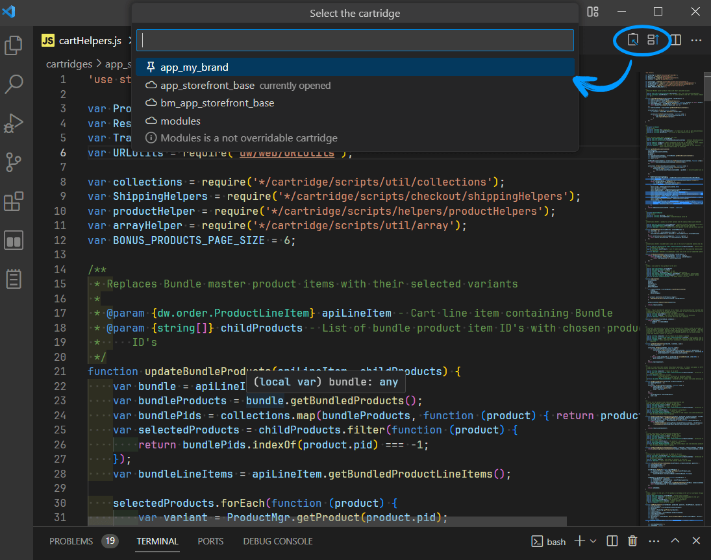

# 🦫 SFCC Beaver

Automate your routine tasks on SFCC projects such as:

- overriding files from one cartridge to another
- copying file path/require/include into clipboard
- searching in documentation

> **💡Compatibility**
Beaver fully supports only SFRA projects. However, some of the feature are compatible with SiteGen as well.

## ⭐ Usage

### Extract/Override

Using extract and override buttons you can save time and make less errors.

-  - copy current file's include into clipboard
-  - override current file into another cartridge

> 💡 You can use commands to t

### Commands

Beaver adds several new commands that you can run manually.

To run a command you need to open the command pallette (press `F1` or `Ctrl + Shift + P`) and enter the command name.

- **Extract file to clipboard** command copies to clipboard require of the file depends on type.
  - for script (JS) file copy require: `var fileName = require('*/filePath')`
  - for template (ISML) file copy isinclude: `<isinclude template='templatePath' />`
  - for resource (PROPERTIES) file copy active line as `Resource.msg('{activeLinePropName}', '{fileName}', null)`
- **Copy Unix path** command copies file path relatively to the project root folder.
- **Override File** command overrides current file to another cartridge

### Beaver Dam

Beaver introduces a new panel called Beaver Dam. There two items:

- **Cartridges** is a active cartridge list where you can pin/unpin cartridge for overriding.
- **Documentation**. Search in docs without leaving VS Code.

### Hovers

If you hover over the API class such as `require('dw/web/URLUtils')` you see a tip with `🦫 Open docs` suggestion. Clicking it will open corresponding documentation topic.

## 👍 Recommendations

Install the icons extension **[🦫 SFCC Beaver - Icons](https://marketplace.visualstudio.com/items?itemName=SerhiiHlavatskyi.sfcc-beaver-icons 'Open marketplace')** to make your project look better.

## 📨 Feedback

Found a 🪲bug or want to improve something? Feel free to open an issue on GitHub: <https://github.com/foegit/sfcc-beaver/issues>
